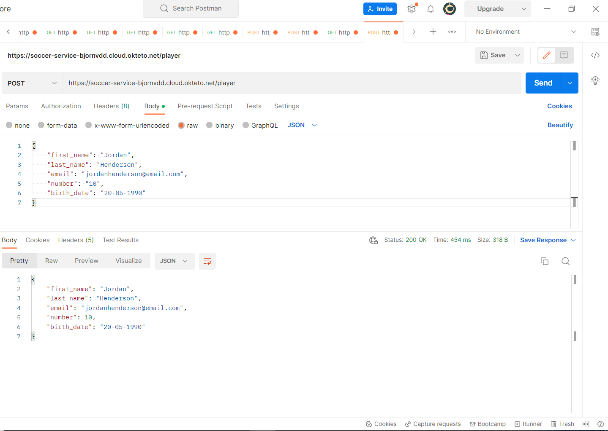

# Soccer API
#### Gemaakt door Bjorn Van den Dungen
#### r0889357

## Over het Project
 Ik heb een API gerealiseerd over het onderwerp Voetbal. Al van jongs af aan was ik geïnteresseerd in voetbal. Ik heb ook tot mijn 18de inter-provincaal gespeeld bij Pelt. Mijn API doet 1 POST-request en 2 GET-requests.

#### POST-request:

 * Bij de POST-request heb je de kans om een speler **aan te maken** die jezelf wilt, de output krijg je dan in JSON formaat.

#### GET-requests:

* Bij de 1ste GET-request kan je alle teams **opvragen**.
* Bij de 2de GET-request kan je een specifieke speler opvragen en daarbij komende **informatie** verkrijgen.

#### Postman Screenshots

* POST-request
