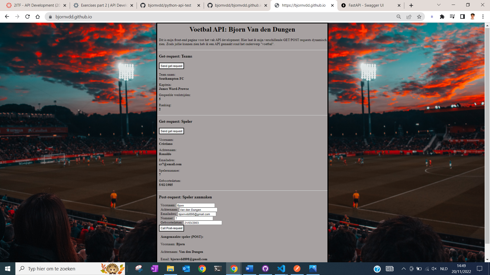
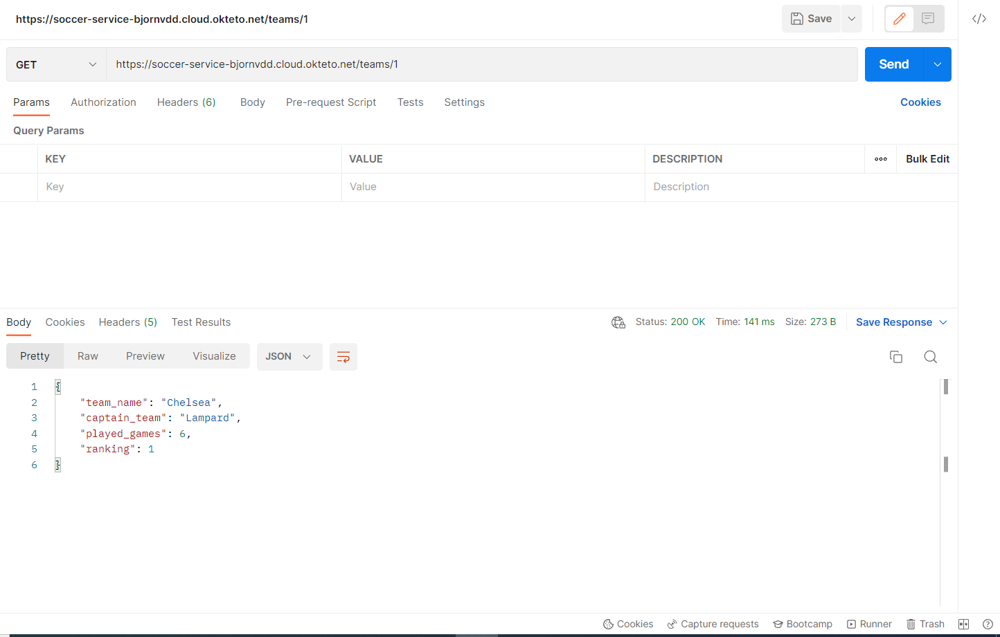
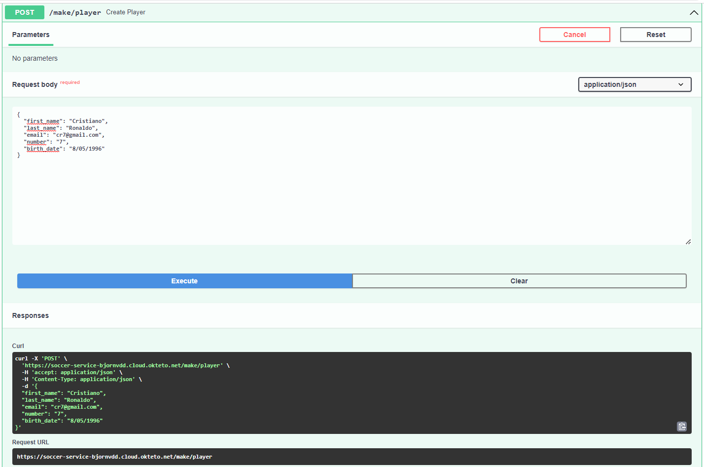
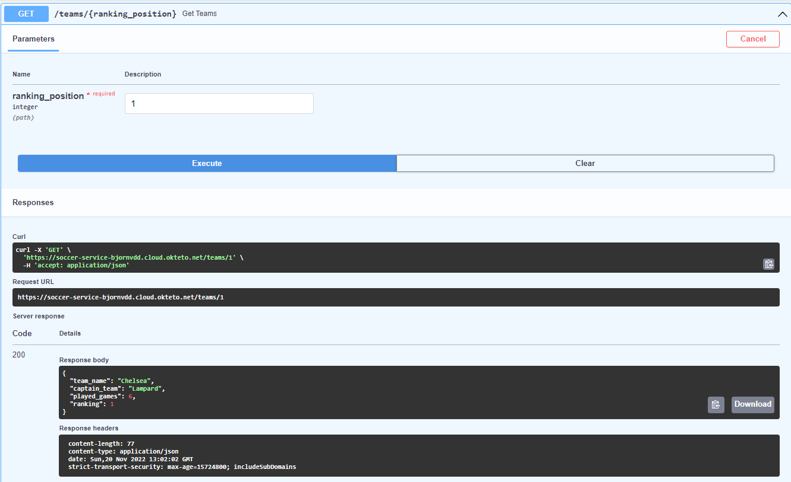
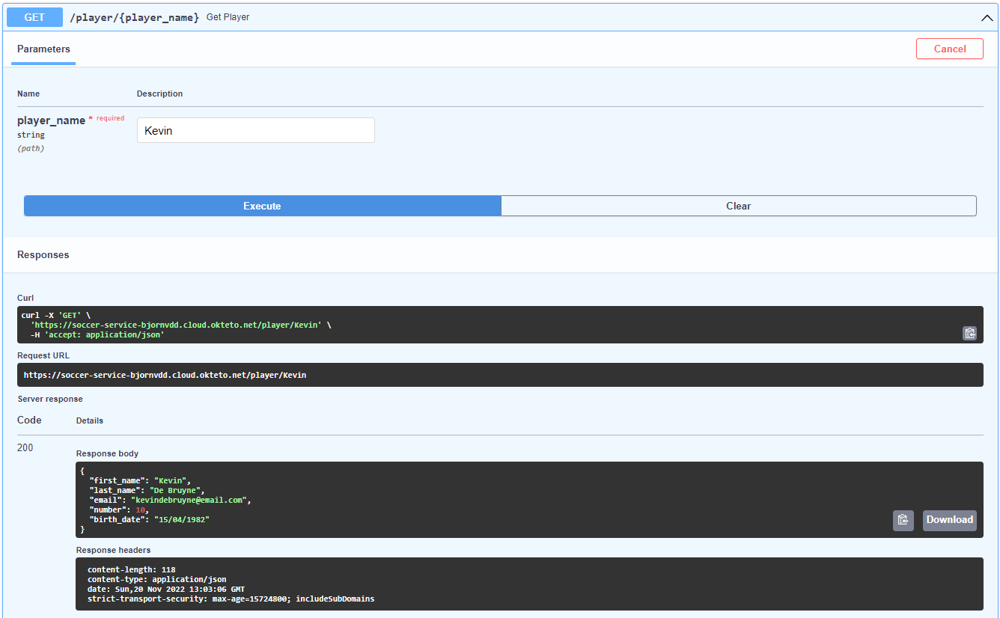

# Voetbal API (Premier League)
#### Gemaakt door Bjorn Van den Dungen
#### r0889357

## Over het thema:
 Ik heb een API gerealiseerd over het onderwerp voetbal. Al van jongs af aan was ik geïnteresseerd in voetbal. Ik heb ook tot mijn 18de inter-provincaal gespeeld bij Pelt. Alle spelers/teams zijn gebaseerd op de "Premier League"

## Over de front-end:

Ik heb ook een front-end pagina erbij gerealiseerd. Ik heb 2 GET-requests en 1 POST-request kunnen programmeren.

Front-end pagina: <a href="https://bjornvdd.github.io">Link naar <strong>hosted</strong> front-end</a>

## Over de API:
Mijn API doet 1 POST-request en 2 GET-requests.

### POST-request:

 * Bij de POST-request heb je de kans om een speler **aan te maken** die jezelf wilt, de output krijg je dan in JSON formaat.

### GET-requests:

* Bij de 1ste GET-request kan je alle teams **opvragen** waarvan ze staan in het klassement (1e,2e,3e plaats...).
* Bij de 2de GET-request kan je een specifieke speler opvragen en daarbij komende **informatie** verkrijgen.

### Postman Screenshots

* POST-request:

### GET-request TEAMS: Top 3 ranking (klassement):

* GET-request --> 1ste plaats klassement:

* GET-request --> 2de plaats klassement:

* GET-request --> 3de plaats klassement:

### GET-request PLAYERS: Een specifieke speler opvragen:

* GET-request --> Cristiano Ronaldo:

* GET-request --> Kevin De Bruyne:

### OpenAPI (docs)

* POST-request: OpenAPI test

* GET-request Team: OpenAPI test

* GET-request Player: OpenAPI test

### Handige links (API)

<a href="https://soccer-service-bjornvdd.cloud.okteto.net">Link naar hosted API</a>

<a href="https://github.com/bjornvdd/bjornvdd.github.io">Link naar front-end Github repository</a>

<a href="https://bjornvdd.github.io">Link naar <strong>hosted</strong> front-end</a>

<a href="#readme-back-top">Back to top</a>
